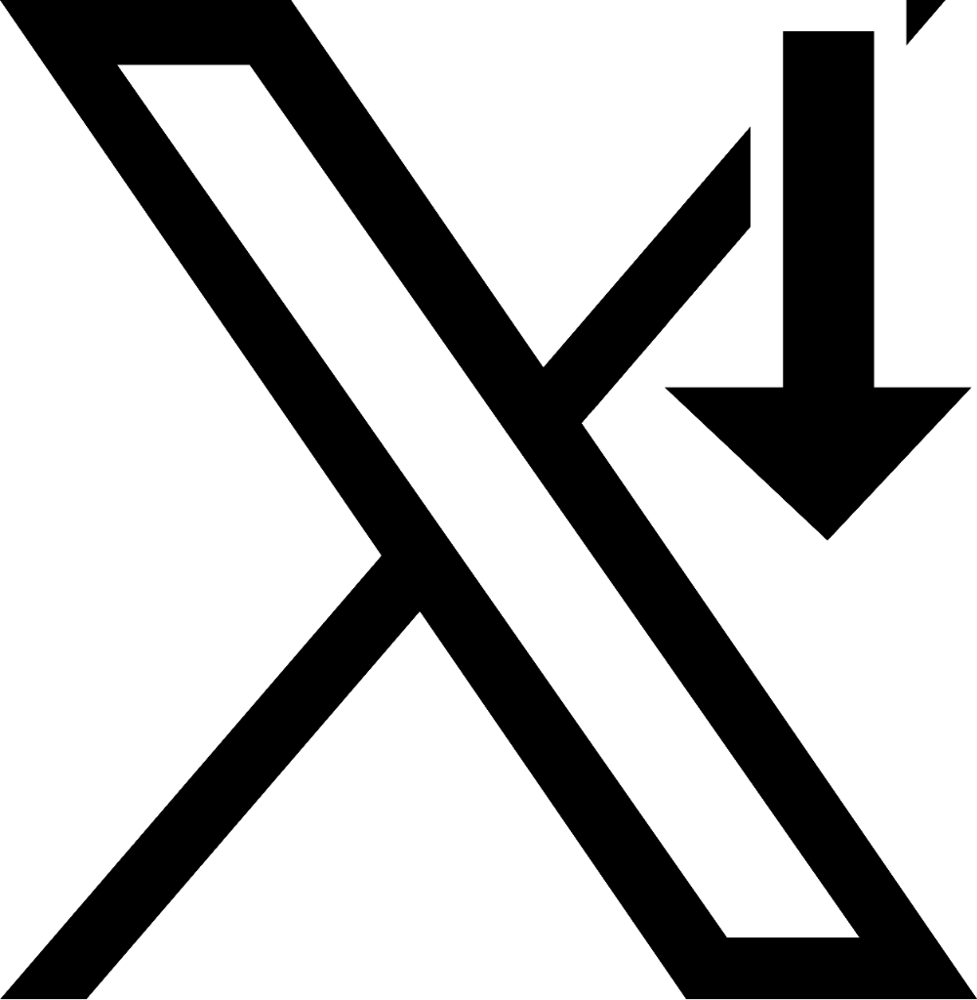

# Marked'X Down

  

**Marked'X Down** 是一款专为 X.com (原 Twitter) 打造的轻量级 Edge/Chrome 浏览器扩展程序。它能自动捕获并极速解析推文中的 Markdown 语法与 LaTeX 数学公式，让时间线上的文字拥有更富表现力的排版体验，同时**绝对不会破坏 X.com 原生的 SPA 路由性能与悬浮卡片功能**。

## ✨ 核心特性 (Features)

- 📝 **完整的 Markdown 支持**: 基于高性能的 `marked.js` 引擎，支持加粗、斜体、删除线、列表、代码块、引用以及表格。
- 📐 **离线 LaTeX 极速渲染**: 内置业界标准的 `KaTeX` 引擎与完整的本地 `.woff2` 字体包，无论网络环境如何，都能瞬间、精准地渲染数学公式（包含行内公式 `$...$` 和行间公式 `$$...$$`）。
- 🛡️ **安全的混合渲染管线**: 采用首创的“优先抢占式”处理策略，LaTeX 解析绝对优先于 Markdown。彻底告别因下划线 `_` 造成的 LaTeX 下标与 Markdown 斜体符号冲突！
- 🤝 **保留原生交互黑科技**: 与其他粗暴替换 DOM 的扩展不同，Marked'X Down 会在解析文本前“剥离并缓存”原生 `@提及`、`#话题` 以及 Emoji，渲染后再无缝插回。这就保留了推特原有的无刷新跳转和用户悬浮资料卡功能。
- 🎨 **无缝融入的原生美学**: 自动探测推文颜色并注入样式，完美兼容 X.com 的“浅色”、“暗色 (Dim)”和“深夜 (Lights Out)”模式；严格控制 `white-space` 以保持原汁原味的紧凑排版。

## ⚙️ 工作机制与触发条件 (How it works)

考虑到日常交流中经常使用 `$` 符号表示货币，为了避免误判，扩展采用**双轨制**渲染：

1. **普通模式 (默认)**：扩展只会解析标准的 Markdown 语法。
2. **LaTeX 模式 (触发制)**：只有当推文中显式包含 `#latexed` 或 `#LaTeXed` 标签时，系统才会激活底层的高级数学管线，此时 `$` 和 `$$` 才会作为公式定界符生效。

## 🚀 安装指南 (Installation)

1. 从本仓库的 [Releases](#) 页面下载最新版本的 `Marked-X-Down.zip`。
2. 解压缩到一个您喜欢的永久文件夹中。
3. 打开 Edge 浏览器，访问 `edge://extensions/`。
4. 开启右上角/左下角的 **“开发人员模式” (Developer mode)**。
5. 点击 **“加载解压缩的扩展” (Load unpacked)**，然后选择您解压出来的文件夹。
6. 刷新 X.com，享受 Markdown 和 LaTeX 的魔力吧！

## 📄 许可证 (License)

本项目采用 [MIT License](LICENSE) 授权。您可以自由地使用、修改和分发。

> **作者**: [CheeseGhostfox / 芝士靈狐](https://github.com/CheeseGhostfox)  
> *Built with ❤️ for a better reading experience on X.*
